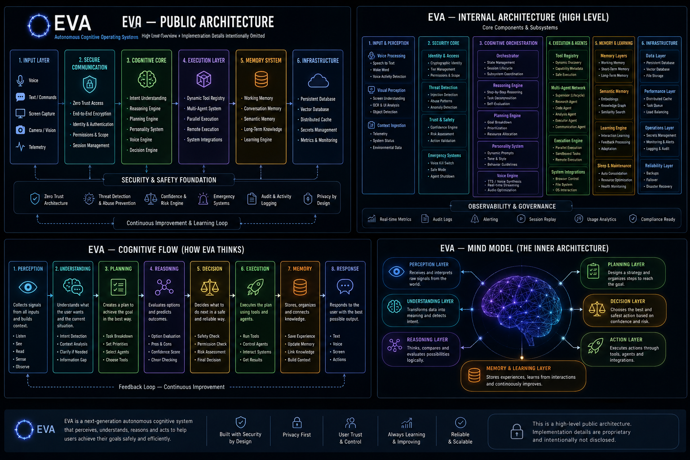
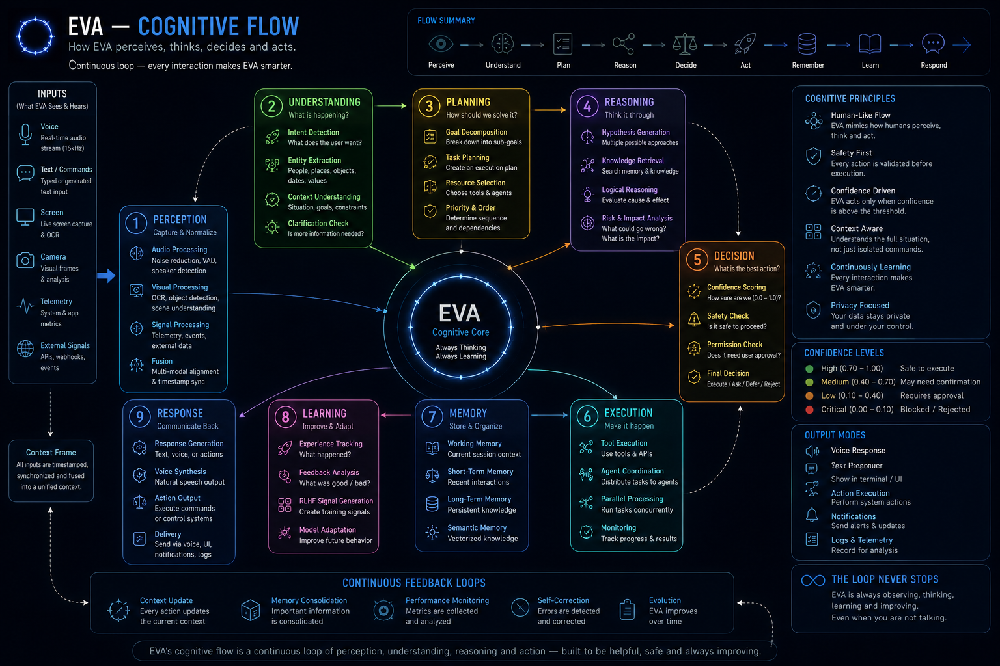

<div align="center">

# ◯ EVA
### Autonomous Cognitive Operating System

Building an autonomous cognitive operating system for natural voice interaction, reasoning, memory and intelligent task execution.

*Implementation details intentionally omitted. This repository contains the public architecture, documentation and development journey of EVA.*

[](https://eva-chatbot.xyz)
[](https://eva-chatbot.xyz)
[](https://ai.google.dev/api/multimodal-live)
[](#)

<br/>

> ⚠️ **Pre-Alpha** — EVA is under active development. Expect breaking changes.
> This repository does not contain EVA's source code. It documents the project's public architecture, development history, and demonstration videos.
> You can try EVA by joining the **[closed beta](https://eva-chatbot.xyz)**.

<br/>

[**Join the Closed Beta →**](https://eva-chatbot.xyz) · [Architecture](#architecture) · [How EVA Thinks](#how-eva-thinks) · [Features](#what-eva-can-do) · [Videos](#watch-eva-evolve) · [Journey](#the-journey-of-eva) · [Status](#current-status)

</div>

---

## What is EVA?

EVA is a **self-hosted autonomous cognitive operating system** — not a chatbot, not a wrapper around an existing assistant, but a full AI infrastructure designed from the ground up around one idea: an assistant should perceive, reason, plan, and act, not just reply.

You speak. EVA listens, understands intent, plans a course of action, executes across a registry of capabilities, coordinates specialized agents when a task is complex, and responds — all in real time, all validated by a security layer that checks every action before it runs.

EVA is built on the premise that a genuinely useful AI assistant needs to be:

- **Always listening**, with minimal latency between thought and response
- **Actually autonomous** — executing multi-step tasks, not just answering questions
- **Fundamentally safe**, with security designed into every layer, not added afterward
- **Continuously improving**, learning from every conversation without sending data to third parties

This isn't a research demo. EVA runs continuously and is in active use in its closed beta.

---

## Architecture

EVA is composed of six interconnected layers, from raw input capture to long-term memory. This is a **high-level public view** — internal implementation, module names, and specific technical details are intentionally not disclosed.

<!-- Upload the architecture diagram to your repo (e.g. docs/eva-public-architecture.png) and update the path below -->


| Layer | Overview |
|---|---|
| **1. Input** | Voice, text / commands, screen capture, camera / vision, system telemetry |
| **2. Secure Communication** | Zero-trust access, end-to-end encryption, identity & authentication, session management |
| **3. Cognitive Core** | Intent understanding, reasoning engine, planning engine, personality system, voice engine, decision engine |
| **4. Execution Layer** | Dynamic Tool Registry, multi-agent system, parallel & remote execution, system integrations |
| **5. Memory System** | Working memory, conversation memory, semantic memory, long-term knowledge, learning engine |
| **6. Infrastructure** | Persistent database, vector database, distributed cache, secrets management, monitoring & audit |

### Security & Safety Foundation

- ✅ Zero-Trust Architecture
- 🛡️ Threat Detection & Abuse Prevention
- ⚖️ Confidence & Risk Engine
- 🚨 Emergency Systems
- 📜 Audit & Activity Logging
- 🔒 Privacy by Design

All six layers feed into a **Continuous Improvement & Learning Loop** — EVA's behavior evolves based on real interactions, entirely on its own infrastructure.

---

## How EVA Thinks

<!-- Upload the cognitive flow diagram to your repo and update the path below -->


| Step | What Happens |
|---|---|
| **1. Perception** | Collects signals from all inputs and builds context |
| **2. Understanding** | Interprets intent and the current situation |
| **3. Planning** | Designs a strategy to reach the goal |
| **4. Reasoning** | Evaluates options and predicts outcomes |
| **5. Decision** | Chooses the safest, most reliable next step |
| **6. Execution** | Carries out the plan through tools and agents |
| **7. Memory** | Stores, organizes, and connects new knowledge |
| **8. Response** | Answers with the best possible output — text, voice, or action |

A feedback loop closes the cycle: every interaction feeds back into planning and reasoning for continuous improvement.

**[→ Open the interactive diagram](docs/eva-mind-flow.html)** — a clickable visualization of this flow and the mind model below.
<br/><sub>To get a live link instead of a downloaded file, enable GitHub Pages on this repo (Settings → Pages → deploy from `/docs`) and link to the resulting URL.</sub>

### EVA Mind — The Inner Model

At a conceptual level, EVA's cognition is organized into layers that work together rather than in strict sequence:

- **Perception Layer** — receives and interprets raw signals from the world
- **Understanding Layer** — transforms data into meaning and detects intent
- **Reasoning Layer** — compares and evaluates possibilities logically
- **Planning Layer** — designs a strategy and organizes steps toward a goal
- **Decision Layer** — chooses the best and safest action given confidence and risk
- **Action Layer** — executes through tools, agents, and integrations
- **Memory & Learning Layer** — stores experience and continuously improves from it

---

## What EVA Can Do

### 🎙️ Real-Time Voice Conversation
EVA connects to **Google's Gemini Live API** for genuinely bidirectional voice streaming. You can interrupt mid-sentence, EVA detects natural pauses, and responds with low-latency, natural-sounding audio. No push-to-talk, no waiting — just conversation.

### 🛠️ Dynamic Tool Registry
EVA doesn't just talk — it acts. Through an extensible, dynamically discovered registry of capabilities, EVA can execute code in an isolated sandbox, research the web, work with files, run system commands, call external services, read on-screen content, manage email and calendar, and more. Actions run concurrently rather than one at a time.

### 🤖 Multi-Agent Coordination
Complex tasks are broken down and distributed across a network of specialized agents, all coordinated by a supervising layer that monitors progress, recovers from failures, and merges results into a single coherent response.

### 🔐 Zero-Trust Security
Every action EVA takes is scored for risk before it executes. Low-confidence or high-risk actions are blocked or require explicit confirmation. An abuse-detection layer tracks anomalous behavior across sessions, emergency voice commands can halt all activity instantly, and inputs are continuously screened for manipulation attempts.

### 🧬 Multi-Layer Memory
EVA remembers at different timescales — what's happening in the current session, a compressed conversation history, and long-term knowledge stored as searchable semantic memory. When a session ends, EVA consolidates what it learned for more efficient future recall.

### 📈 Continuous Learning
EVA tracks corrections, disagreements, and rephrasing to build a private, local feedback loop that improves its behavior over time — without sending data to third parties for training.

### 🎭 Adaptive Personality
EVA's personality isn't a static script. It's built dynamically per session from context, preferences, and history, adapting tone and proactivity to the person it's talking with.

### ⚙️ Infrastructure-Grade Reliability
Signed, atomic over-the-air updates with automatic rollback. Fully isolated multi-tenant sessions. Automatic reconnection with session restoration. Proactive task scheduling with calendar integration.

---

## Documentation

Deeper write-ups on each part of the system, one file per subsystem:

| Doc | Covers |
|---|---|
| [Cognitive Pipeline](docs/01_cognitive_pipeline.md) | How EVA moves from input to decision — the cognitive flow in detail |
| [Reasoning System](docs/02_reasoning_system.md) | How EVA reasons, weighs options, and plans multi-step actions |
| [Agent Network](docs/03_agent_network.md) | How specialized agents coordinate on complex tasks |
| [Memory System](docs/04_memory_system.md) | How EVA remembers, from working memory to long-term semantic knowledge |
| [Security & Trust](docs/05_security_trust.md) | The Zero-Trust model — how every action is verified before it runs |
| [Continuous Learning](docs/06_continuous_learning.md) | How EVA learns and improves from real interactions over time |

<!-- Assumes these six files live in a docs/ folder at the repo root — update the paths above if you place them elsewhere -->

---

## The Journey of EVA

EVA was not built overnight.

The project began as a personal experiment with the goal of creating a voice-first autonomous AI assistant capable of reasoning, acting, and continuously improving.

Over the years the architecture evolved through dozens of redesigns, prototypes, and experiments.

Many of the early demonstrations available on YouTube show previous versions of EVA. They contain bugs, limitations, and unfinished ideas that have since been redesigned or completely replaced.

Rather than hiding that history, we keep it available because it documents the evolution of the project and the lessons learned along the way.

Every iteration helped shape the current architecture.

### Development Timeline

<div align="center">

**2022** — First Voice Prototype
↓
Basic Chat Assistant
↓
First Tool Calling
↓
First Memory System
↓
Multi-Agent Prototype
↓
Zero-Trust Security
↓
Continuous Learning Engine
↓
**Current** — Pre-Alpha

</div>

---

## Watch EVA Evolve

The videos below document the evolution of EVA throughout its development.

Some demonstrations correspond to very early prototypes. Although many of those versions contained bugs, missing features, or architectural limitations, they represent important milestones in the development process. Most of those issues have already been solved in the current architecture.

Watching the progression helps understand how EVA has matured over time.

> **A heads-up before you watch:** these are unedited recordings from earlier stages of development — nothing here is staged. You'll see real bugs, crashes, and rough edges that have since been fixed. You'll also hear some humor that leans a bit heavy/dark at points; that's just how those sessions went, and it's left in rather than cut out. Take it as proof EVA was actually running live and doing real things. More recordings will be published soon.

<!-- Update these titles if they don't match the actual content of each video -->
- 🎬 [Demo — Session 1](https://www.youtube.com/watch?v=BTvkvvDcymc&t=723s)
- 🎬 [Demo — Session 2](https://www.youtube.com/watch?v=npyZ3aW2aX8&t=11s)
- 🎬 [Demo — Session 3](https://www.youtube.com/watch?v=bWXXYD858_M&t=6s)
- 🆕 [Latest Demo](https://www.youtube.com/watch?v=mxGrBLIt1t0&t=2s)

More videos coming soon.

---

## Design Principles

<div align="center">

Built with Security First
↓
Voice Native
↓
Human Centered
↓
Privacy First
↓
Continuous Learning
↓
Autonomous by Design
↓
Modular Architecture
↓
Scalable Infrastructure

</div>

---

## Current Status

```
Architecture       ██████████████ 100%
Security            ██████████████ 100%
Voice Engine         ██████████████ 100%
Memory                ██████████████ 100%
Agent Network          ██████████████ 100%
Desktop Client          █████████████░  95%
Web Client               ███████░░░░░░░  55%
Mobile                    ██░░░░░░░░░░░░  15%
```

---

## Try EVA — Closed Beta

EVA is currently in **pre-alpha**. The system is functional and in active daily use, but behavior and features may change without notice.

<div align="center">

### [→ Join the Closed Beta at eva-chatbot.xyz](https://eva-chatbot.xyz)

</div>

Beta access includes full access to EVA's voice and text interface, tool access depending on your tier, a direct feedback channel to the development team, and early access to new features.

---

## Roadmap

| Milestone | Status |
|---|---|
| Core voice orchestrator | ✅ Complete |
| Zero-Trust security layer | ✅ Complete |
| Dynamic Tool Registry | ✅ Complete |
| Multi-agent network | ✅ Complete |
| Multi-layer memory system | ✅ Complete |
| Continuous learning engine | ✅ Complete |
| Signed OTA auto-update | ✅ Complete |
| Closed beta | 🔄 Active |
| Web client | 🔜 Planned |
| Mobile client (iOS / Android) | 🔜 Planned |
| Plugin / extension system | 🔜 Planned |
| Self-hosted model support | 🔜 Planned |

---

## Collaboration

EVA is an independent project, not affiliated with Google, OpenAI, or any other AI company. That said, we're genuinely open to hearing from:

- **Researchers** interested in Zero-Trust architectures for AI agents or multi-agent coordination
- **Developers** curious about voice-first autonomous assistants
- **Organizations** exploring private, self-hosted AI infrastructure

If this resonates with what you're building, reach out through the beta platform at [eva-chatbot.xyz](https://eva-chatbot.xyz).

---

## Acknowledgements

EVA would not exist in its current form without the incredible work of the broader AI community.

We are deeply grateful to the researchers, engineers and organizations who continue advancing the state of artificial intelligence. In particular, we would like to thank:

**Google** — for providing outstanding developer tools, Gemini models and the Gemini Live API, which made real-time voice interaction possible.

**OpenAI** — for their language models, APIs and research that helped shape many ideas explored during EVA's development.

These technologies are used through their official public APIs. EVA is an independent project and is not affiliated with or endorsed by Google or OpenAI.

---

## Built with Passion

EVA is the result of years of learning, experimentation and continuous iteration.

Every component has been designed with one goal in mind: to build an AI system that is helpful, reliable and genuinely useful in everyday life.

The journey is far from over.

Thank you to everyone who has supported the project, tested early versions, reported bugs and shared ideas. Your feedback has helped shape EVA into what it is today.

This is only the beginning.

---

## Notices

- Google Gemini Live API is a product of Google LLC, used via its public API. EVA is not affiliated with or endorsed by Google.
- OpenAI's models and APIs are products of OpenAI, used via their public API. EVA is not affiliated with or endorsed by OpenAI.
- This repository does not include EVA's source code. It documents the project's public architecture, development history, and demonstration videos.

---

<div align="center">

**EVA** — Pre-Alpha · Closed Beta Active

[eva-chatbot.xyz](https://eva-chatbot.xyz)

*Built by humans. For humans. Carefully.*

</div>
